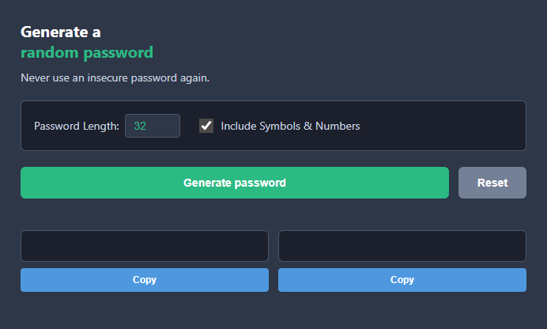

# Random Password Generator

A simple, fast, and secure random password generator built with HTML, CSS, and JavaScript. Generate two secure passwords at once with a single click.

## Preview



## Features

- **Single Click Generation**: Generate a secure random password with one button click
- **Secure Character Set**: Includes uppercase, lowercase, numbers, and special characters
- **Dark Theme UI**: Clean and modern dark interface
- **Responsive Design**: Works seamlessly on desktop and mobile devices
- **12-Character Passwords**: Each generated password contains 12 characters for strong security

## How to Use

1. Open `index.html` in your web browser
2. Click the "Generate password" button on either card
3. A random 12-character password will appear below the button
4. Click again to generate a new password

## Character Set

The generator uses the following character set for password generation:

```
A-Z, a-z, 0-9, and special characters: ~`!@#$%^&*()_-+={[}],|:;<>.?/
```

This ensures strong, unpredictable passwords that are difficult to crack.

## Guidelines

### Password Security

- **Length**: Each password is 12 characters long, providing strong security
- **Variety**: Passwords include uppercase letters, lowercase letters, numbers, and special characters
- **Randomness**: Characters are selected randomly, ensuring no pattern

### Best Practices

- Generate a new password for each online account
- Never reuse passwords across different services
- Store your passwords in a secure password manager
- If a password is compromised, generate a new one immediately

### Technology Stack

- **HTML5** - Structure and semantic markup
- **CSS3** - Styling with flexbox and grid layout
- **Vanilla JavaScript** - Password generation logic and interactivity
- **Vite** - Development build tool

## Stretch Goals

- [x] SET PASSWORD LENGTH - Allow users to customize password length
- [x] ADD COPY AND CLICK - Copy passwords to clipboard with one click
- [x] TOGGLE SYMBOLS AND NUMBERS on/off - Allow users to customize character set

## Getting Started

### Development

```bash
npm install
npm run dev
```

### Build

```bash
npm run build
```

### Preview

```bash
npm run preview
```

## Project Structure

```
password-generator/
├── index.html       # Main HTML structure
├── index.css        # Styling
├── index.js         # Password generation logic
├── package.json     # Project configuration
├── vite.config.js   # Vite configuration
└── images/
    └── preview.png  # Project preview image
```

## License

This project is open source and available for personal and educational use.
